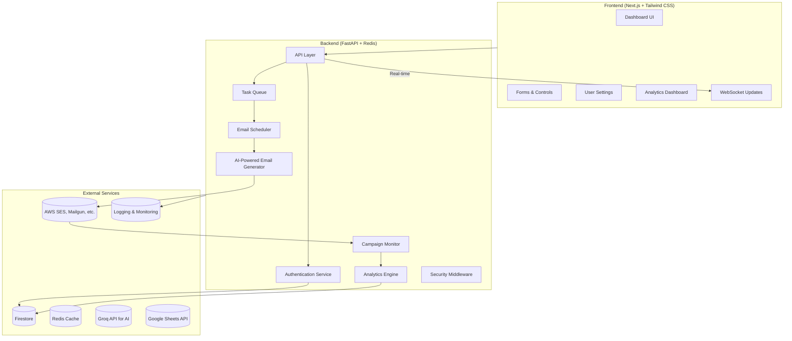

# 🚀 **Custom Email Sender Application**

## Overview
This application is a state-of-the-art **email automation platform**, developed for **Breakout Consultancy's internship assessment**. It combines robust functionality with a sleek user interface to empower businesses with tools for **personalized email campaigns**, **data integration**, and **real-time performance tracking**.

---

## 🌟 **Features at a Glance**
1. **📡 Data Integration**
   - Seamless Google Sheets API support.
   - CSV file uploads with automatic data parsing.
   - Intelligent column mapping for faster workflows.

2. **🎨 Email Customization**
   - **AI-powered content generation** with Groq API.
   - Templated emails with dynamic placeholders.
   - Recipient-specific personalization for targeted campaigns.

3. **⏳ Scheduling & Throttling**
   - Schedule emails for precise delivery timing.
   - Adjustable rate limiting to manage bulk sends.
   - High-performance background processing.

4. **📊 Real-Time Analytics**
   - Track email delivery, open, and click rates.
   - Exportable performance dashboards.
   - In-app error reporting and retry mechanisms.

5. **🔒 Security First**
   - OAuth2 authentication for external integrations.
   - API gateway with robust rate limiting.
   - Secure data storage using Firestore.

---

## 📊 **Tech Stack**



---

## 🛠️ **Prerequisites**
Ensure you have the following before installation:
- **Python**: Version 3.9 or above.
- **Node.js**: Version 16 or above.
- **AWS SES Account** with verified sender domains.
- **Google Cloud Project** with Sheets API enabled.
- **Groq API Key** for AI content generation.
- **Firebase Project** for database services.

---

## 🚀 **Installation Guide**

### **1. Clone the Repository**
```bash
git clone https://github.com/yourusername/email-automation.git
cd email-automation
```

---

### **2. Backend Setup**
1. **Set up a Virtual Environment**
   ```bash
   python -m venv venv
   source venv/bin/activate  # For Windows: venv\Scripts\activate
   ```

2. **Install Dependencies**
   ```bash
   pip install -r requirements.txt
   ```

3. **Configure Environment Variables**
   Create a `.env` file with:
   ```plaintext
   REDIS_URL=your_redis_url
   GROQ_API_KEY=your_groq_api_key
   GOOGLE_SHEETS_CREDENTIALS_PATH=/path/to/credentials.json
   AWS_ACCESS_KEY_ID=your_access_key
   AWS_SECRET_ACCESS_KEY=your_secret_key
   AWS_REGION=your_region
   SES_SENDER_EMAIL=meghana.sancheti@gmail.com
   FIREBASE_CREDENTIALS_PATH=/path/to/firebase.json
   RATE_LIMIT_EMAILS_PER_HOUR=100
   MAX_BATCH_SIZE=1000
   CONCURRENT_LIMIT=5
   ```

4. **Run the Backend**
   ```bash
   uvicorn app.main:app --reload
   ```

---

### **3. Frontend Setup**
1. Navigate to the `frontend` directory:
   ```bash
   cd frontend
   ```

2. Install dependencies:
   ```bash
   npm install
   ```

3. Start the development server:
   ```bash
   npm run dev
   ```

---

## 🎨 **UI Snapshots**

### Dashboard View


### Template Builder


### Scheduling & Throttling


---

## 🧪 **Testing**

### Backend Tests
Run automated tests:
```bash
pytest tests/
```

### Frontend Tests
Run unit tests:
```bash
npm test
```

---

## 🚨 **Troubleshooting**

| Issue                       | Possible Solution                           |
|-----------------------------|---------------------------------------------|
| Emails not sending          | Verify SES sender email and region.         |
| API keys not working        | Double-check `.env` configuration.          |
| Google Sheets error         | Ensure correct service account credentials. |
| Delayed email delivery      | Adjust rate limits in `.env`.               |

---

## 📄 **License**
This project is licensed under the **MIT License**. Contributions are welcome.

---

## 🛠️ **Future Enhancements**
- Multi-language support for email templates.
- Enhanced analytics with predictive AI metrics.
- Dynamic A/B testing for email campaigns.
- Integration with additional ESPs like SendGrid and Mailgun.

---

### **Why This Project Stands Out**
1. **AI Integration**: Leverages the power of Groq API for intelligent content personalization.
2. **Scalability**: Designed to handle high volumes with robust backend architecture.
3. **Real-Time Feedback**: Ensures actionable insights with live analytics dashboards.

*Developed by **Meghana Sancheti** for **Breakout Consultancy Internship Assessment.***

---
