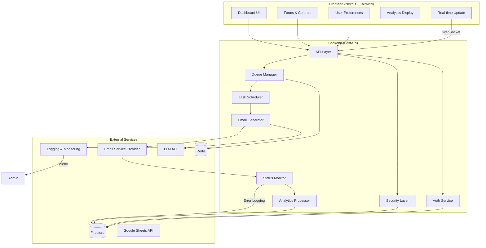

# 🚀 Custom Email Sender Application

## Overview
This project is a custom email-sending application designed for Breakout Consultancy's internship assessment. The application provides a comprehensive solution for automated, personalized email campaigns with advanced features like data connection, email customization, scheduling, and real-time analytics.

## 📊 Tech Stack Overview



## 🔧 Technical Components
- **Frontend**: NextJs
- **Backend**: FastAPI
- **Database**: Firebase Firestore
- **Caching**: Redis
- **Email Service**: AWS SES
- **AI Content Generation**: Groq API
- **Data Source**: Google Sheets, CSV Upload
- **Authentication**: SMTP

## 🌟 Key Features
1. **Data Connection**
   - Google Sheets integration
   - CSV file upload
   - Automatic column detection

2. **Email Customization**
   - Dynamic content generation using Groq API
   - Placeholder-based templating
   - Per-recipient personalization

3. **Email Scheduling & Throttling**
   - Schedule emails at specific times
   - Configurable rate limiting
   - Background job processing

4. **Real-Time Analytics**
   - Email send status tracking
   - Delivery metrics
   - Performance dashboards

## 🛠 Prerequisites
- Python 3.9+
- Node.js 16+
- AWS Account
- Firebase Project
- Groq API Key
- Amazon SES Account

## 🚀 Installation & Setup

### Backend Setup
1. Clone the repository
```bash
git clone https://github.com/yourusername/email-automation.git
cd email-automation
```

2. Create a virtual environment
```bash
python -m venv venv
source venv/bin/activate  # On Windows, use `venv\Scripts\activate`
```

3. Install dependencies
```bash
pip install -r requirements.txt
```

4. Configure Environment Variables
Create a `.env` file with the following:
```

REDIS_URL= redis url
GROQ_API_KEY=groq api key


GOOGLE_SHEETS_CREDENTIALS_PATH=creds path

AWS_ACCESS_KEY_ID=your access key
AWS_SECRET_ACCESS_KEY= your secret key
AWS_REGION= your region
SES_SENDER_EMAIL=meghana.sancheti@gmail.com
SES_CONFIGURATION_SET=your_config_set_name

FIREBASE_CREDENTIALS_PATH=path to json file

RATE_LIMIT_EMAILS_PER_HOUR=100
MAX_BATCH_SIZE=1000
CONCURRENT_LIMIT=5
```

### Frontend Setup
```bash
cd frontend
npm install
npm start
```

## 🔐 Configuration

### Email Service Provider
- Supports AWS SES, SendGrid, Mailgun
- Configure credentials in `.env`
- Set up verified sender domains

### Google Sheets Integration
1. Create a Google Cloud Project
2. Enable Google Sheets API
3. Generate service account credentials
4. Download JSON key and set path in `.env`

## 📸 Screenshots

### Dashboard
![Dashboard Screenshot]


### Email Template Builder
![Template Builder]

### Throttle and Scheduling
![Throttle and Scheduling] 


### Analytics View
![Analytics Dashboard] 


## 🧪 Testing
```bash
# Backend Tests
pytest tests/

# Frontend Tests
npm test
```


## 🚨 Troubleshooting
- Ensure all API keys are correctly configured
- Check network connectivity
- Verify email service provider limits
- Review application logs

## 📄 License
MIT License


---

*Developed for Breakout Consultancy Internship Assessment*
