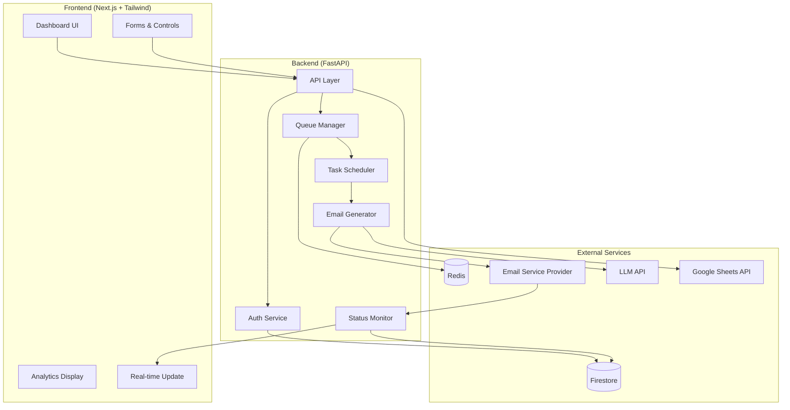

# Advanced Email Automation Dashboard

An enterprise-grade email automation system featuring LLM-powered personalization, real-time analytics, and sophisticated campaign management capabilities.


[](https://coveralls.io/github/yourusername/email-automation?branch=main)
[](https://opensource.org/licenses/MIT)

## 📑 Table of Contents
- [System Architecture](#-system-architecture)
- [Features](#-features)
- [Technical Stack](#-technical-stack)
- [Getting Started](#-getting-started)
- [Development Guide](#-development-guide)
- [Production Deployment](#-production-deployment)
- [API Documentation](#-api-documentation)
- [Contributing](#-contributing)

## 🏗 System Architecture



## ✨ Features

### Email Campaign Management
- **Smart Content Generation**
  ```python
  # backend/services/email_generator.py
  class EmailGenerator:
      def __init__(self, llm_client):
          self.llm_client = llm_client
          
      async def generate_personalized_content(self, template: str, context: dict) -> str:
          prompt = self._build_prompt(template, context)
          response = await self.llm_client.generate(prompt)
          return self._post_process(response)
  ```

- **Dynamic Data Integration**
  ```python
  # backend/services/data_processor.py
  class DataProcessor:
      async def process_sheet_data(self, sheet_id: str) -> List[Dict]:
          data = await self.sheets_client.get_sheet_data(sheet_id)
          return self.validate_and_transform(data)
          
      def validate_and_transform(self, data: List[Dict]) -> List[Dict]:
          schema = self.get_validation_schema()
          return [self.validate_row(row, schema) for row in data]
  ```

### Real-time Campaign Monitoring
- **WebSocket Updates**
  ```typescript
  // frontend/lib/websocket.ts
  export class CampaignMonitor {
    private ws: WebSocket;
    private subscribers: Set<(data: UpdateData) => void>;

    constructor(campaignId: string) {
      this.ws = new WebSocket(`${WS_URL}/campaign/${campaignId}`);
      this.subscribers = new Set();
      
      this.ws.onmessage = (event) => {
        const data = JSON.parse(event.data);
        this.notifySubscribers(data);
      };
    }

    subscribe(callback: (data: UpdateData) => void) {
      this.subscribers.add(callback);
      return () => this.subscribers.delete(callback);
    }
  }
  ```

### Advanced Queue Management
```python
# backend/services/queue_manager.py
class QueueManager:
    def __init__(self, redis_client: Redis):
        self.redis = redis_client
        self.queues = {
            'high': Queue('high', connection=redis_client),
            'default': Queue('default', connection=redis_client),
            'low': Queue('low', connection=redis_client)
        }
    
    async def enqueue_campaign(self, campaign: Campaign) -> str:
        priority = self._determine_priority(campaign)
        job = self.queues[priority].enqueue(
            'process_campaign',
            campaign.id,
            job_timeout='1h'
        )
        return job.id
```

## 🛠 Technical Stack

### Backend Components
- **FastAPI Application Structure**
  ```
  backend/
  ├── app/
  │   ├── api/
  │   │   ├── routes/
  │   │   │   ├── auth.py
  │   │   │   ├── campaigns.py
  │   │   │   └── analytics.py
  │   │   └── dependencies.py
  │   ├── core/
  │   │   ├── config.py
  │   │   └── security.py
  │   ├── services/
  │   │   ├── email_generator.py
  │   │   ├── queue_manager.py
  │   │   └── campaign_monitor.py
  │   └── models/
  │       ├── campaign.py
  │       └── user.py
  ├── alembic/
  └── tests/
  ```

### Frontend Architecture
```typescript
// frontend/lib/hooks/useCampaign.ts
export function useCampaign(campaignId: string) {
  const [status, setStatus] = useState<CampaignStatus>();
  const [analytics, setAnalytics] = useState<Analytics>();
  
  useEffect(() => {
    const monitor = new CampaignMonitor(campaignId);
    const unsubscribe = monitor.subscribe((data) => {
      setStatus(data.status);
      setAnalytics(data.analytics);
    });
    
    return () => unsubscribe();
  }, [campaignId]);
  
  return { status, analytics };
}
```

## 🚀 Getting Started

### Prerequisites
- Python 3.9+
- Node.js 16+
- Docker & Docker Compose
- Google Cloud account
- ESP account (SendGrid/Mailgun/AWS SES)

### Local Development Setup

1. **Clone and Configure Environment**
   ```bash
   git clone https://github.com/yourusername/email-automation
   cd email-automation
   
   # Setup backend
   cd backend
   python -m venv venv
   source venv/bin/activate
   pip install -r requirements.txt
   cp .env.example .env
   
   # Setup frontend
   cd ../frontend
   npm install
   cp .env.example .env.local
   ```

2. **Start Development Services**
   ```bash
   # Start infrastructure services
   docker-compose up -d redis firestore
   
   # Start backend
   cd backend
   uvicorn app.main:app --reload
   
   # Start frontend
   cd frontend
   npm run dev
   ```

## 🔧 Development Guide

### Authentication Implementation
```python
# backend/app/core/security.py
from fastapi_security import OAuth2PasswordBearer
from jose import JWTError, jwt
from datetime import datetime, timedelta

class SecurityService:
    def __init__(self, settings: Settings):
        self.settings = settings
        
    def create_access_token(self, data: dict) -> str:
        expire = datetime.utcnow() + timedelta(minutes=30)
        to_encode = {**data, "exp": expire}
        return jwt.encode(
            to_encode, 
            self.settings.SECRET_KEY, 
            algorithm=self.settings.ALGORITHM
        )
```

### Campaign Service
```python
# backend/app/services/campaign_service.py
class CampaignService:
    def __init__(
        self,
        queue_manager: QueueManager,
        email_generator: EmailGenerator,
        monitor: CampaignMonitor
    ):
        self.queue_manager = queue_manager
        self.email_generator = email_generator
        self.monitor = monitor
    
    async def create_campaign(self, data: CampaignCreate) -> Campaign:
        campaign = await self._create_campaign_record(data)
        await self.queue_manager.enqueue_campaign(campaign)
        return campaign
```

## 📦 Production Deployment

### Infrastructure Setup
```terraform
# terraform/main.tf
resource "google_cloud_run_service" "api" {
  name     = "email-automation-api"
  location = "us-central1"
  
  template {
    spec {
      containers {
        image = "gcr.io/project/email-automation-api"
        
        env {
          name  = "DATABASE_URL"
          value = google_firestore_database.main.url
        }
      }
    }
  }
}
```

### Monitoring Setup
```python
# backend/app/core/monitoring.py
from opentelemetry import trace
from prometheus_client import Counter, Histogram

class Metrics:
    email_sent = Counter(
        'emails_sent_total',
        'Number of emails sent',
        ['status']
    )
    
    generation_time = Histogram(
        'email_generation_seconds',
        'Time spent generating emails'
    )
```

## 📚 API Documentation

### Campaign Endpoints
```python
@router.post("/campaigns/", response_model=Campaign)
async def create_campaign(
    data: CampaignCreate,
    service: CampaignService = Depends(get_campaign_service)
):
    """
    Create a new email campaign.
    
    Parameters:
    - template_id: ID of the email template
    - recipients: List of recipient email addresses
    - schedule: Optional scheduling parameters
    - throttle: Optional throttling configuration
    """
    return await service.create_campaign(data)
```

## 🔒 Security Features

### Rate Limiting
```python
# backend/app/core/middleware.py
from fastapi import Request
from redis import Redis

class RateLimiter:
    def __init__(self, redis: Redis):
        self.redis = redis
        
    async def check_rate_limit(self, request: Request):
        key = f"rate_limit:{request.client.host}"
        current = self.redis.incr(key)
        if current == 1:
            self.redis.expire(key, 60)
        return current <= 60
```

### Input Validation
```python
# backend/app/models/campaign.py
from pydantic import BaseModel, EmailStr, validator

class CampaignCreate(BaseModel):
    template_id: str
    recipients: List[EmailStr]
    schedule: Optional[ScheduleConfig]
    
    @validator('recipients')
    def validate_recipients(cls, v):
        if len(v) > 1000:
            raise ValueError('Maximum 1000 recipients per campaign')
        return v
```

## 🧪 Testing

### Backend Tests
```python
# backend/tests/services/test_campaign_service.py
import pytest
from app.services.campaign_service import CampaignService

async def test_campaign_creation():
    service = CampaignService(
        queue_manager=MockQueueManager(),
        email_generator=MockEmailGenerator(),
        monitor=MockCampaignMonitor()
    )
    
    campaign = await service.create_campaign(
        CampaignCreate(
            template_id="test",
            recipients=["test@example.com"]
        )
    )
    
    assert campaign.status == "queued"
```

### Frontend Tests
```typescript
// frontend/tests/components/CampaignForm.test.tsx
import { render, fireEvent, waitFor } from '@testing-library/react'
import { CampaignForm } from '@/components/CampaignForm'

describe('CampaignForm', () => {
  it('validates recipient emails', async () => {
    const { getByLabelText, getByText } = render(<CampaignForm />)
    
    fireEvent.change(getByLabelText('Recipients'), {
      target: { value: 'invalid-email' },
    })
    
    await waitFor(() => {
      expect(getByText('Invalid email format')).toBeInTheDocument()
    })
  })
})
```

## 🤝 Contributing

### Development Workflow
1. Fork the repository
2. Create a feature branch: `git checkout -b feature/amazing-feature`
3. Commit your changes: `git commit -m 'feat: add amazing feature'`
4. Push to the branch: `git push origin feature/amazing-feature`
5. Open a Pull Request

### Code Style
- Python: Black formatter, isort for imports
- TypeScript: Prettier + ESLint
- Commit messages: Conventional Commits

## 📄 License

MIT License - see [LICENSE.md](LICENSE.md)

